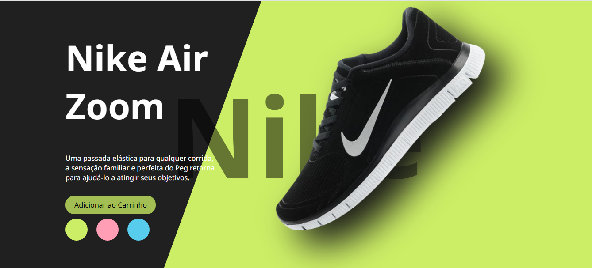

# Site Clone Nike

  

  <b>Clone de landing page da Nike</b> desenvolvido para prática de front-end, focando em HTML, CSS e JavaScript puro.

---

## 🛠 Tecnologias utilizadas

- HTML5
- CSS3
- JavaScript

## 📸 Layout

## 🚀 Funcionalidades

- Trocar a cor do fundo onde aparece o tênis conforme a escolha do usuário.
- Animações suaves nas transições de cor.
- Quando clica no botão adicionar ao carrinho abre uma caixa de notificação e um contador simulando quantos produtos foram adicionados.

## 📚 Sobre o projeto

Esse projeto foi desenvolvido como prática de habilidades de front-end, focando na criação de uma interface interativa e responsiva inspirada no estilo moderno da Nike, utilizando apenas tecnologias nativas da web.

---

Esse projeto é apenas para fins de estudo e prática de desenvolvimento web.

---
  
## 📩 Contato

Se tiver alguma dúvida ou precisar de mais informações, entre em contato diretamente pelo WhatsApp:  
[WhatsApp - Patricia Ferreira](https://wa.me/5534999035964)

**Nota:** 
Tenho um site totalmente funcional, desenvolvido em **HTML** e **CSS**, com um design **clean** e moderno. Você pode conferir o projeto clicando no link abaixo:

<a href="https://pattymarwebdev.github.io/sitebemfeitomultiservicos/" target="_blank">Acesse o site Bem Feito Multiserviços</a>

## ❤️ Créditos

“Código com propósito, design com alma.”

  Feito com 💙 por Patricia Ferreira

---

## 🚀 Badges

